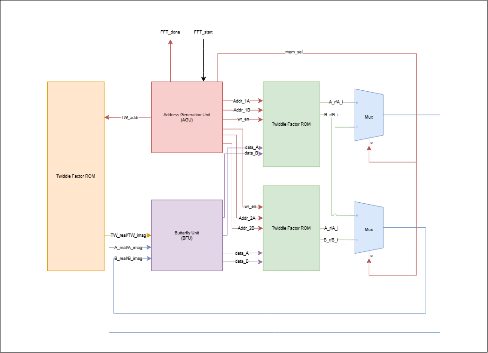
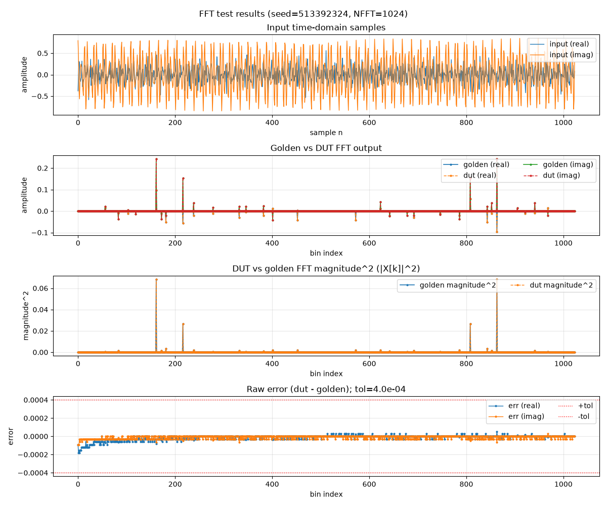

# Radix-2 DIT FFT

The repo features an implementation of the Cooley-Tukey Radix-2 Decimation-In-Time (DIT) FFT algorithm.

$$
X_m = \sum_{n=0}^{N-1} x_n w^{nm},
\qquad
w = e^{-j\frac{2\pi}{N}}
$$

where:

- $x_n$: input samples
- $X_m$: $m$-th frequency-domain output
- $N$: number of samples
- $n$: input sample index, $0 \le n < N$
- $w$: DFT twiddle factor

## Project Overview

- Radix-2 DIT, single butterfly datapath: One butterfly unit is time-multiplexed across all `log2(N)` stages of the FFT. This decision reduces throughput in favor of area.
- Ping-Pong memory: Two memory banks alternate between being computed into and being loaded/unloaded, so the core can accept an input frame concurrently with streaming out the previous frame's results.
- Input Index Bit-Reversal: Input indices are bit-reversed on the way into memory so that after the butterfly stages complete, outputs come out in a natural order.

## Module Interface

| Signal | Dir | Width | Description |
|---|---|---|---|
| `i_Clk` | in | 1 | Clock |
| `reset` | in | 1 | Synchronous active-high reset |
| `i_tdata_re` / `i_tdata_im` | in | `DATA_WIDTH` | Input sample, real/imaginary, signed Q-format |
| `i_tvalid` | in | 1 | Input sample valid |
| `o_tready` | out | 1 | Core is accepting input samples |
| `o_tdata_re` / `o_tdata_im` | out | `DATA_WIDTH` | Output spectrum sample X[k], real/imaginary |
| `o_mag_sq` | out | `2*DATA_WIDTH+1` | `re^2 + im^2` for the current output sample |
| `o_xk_index` | out | `log2(NFFT)` | Bin index `k` that the current output beat corresponds to |
| `o_tvalid` | out | 1 | Output sample valid |

## FFT Diagram

- The Address Generation Unit (AGU) handles address generation as well as control signals to write/read from and to the memory banks.
- The Butterfly Unit (BFU) performs a 2-point FFT on inputs A and B.
- The Twiddle Factor ROM stores real and imaginary twiddle factors for each FFT index.

## Simulation Results

.png)

- 1024-pt FFT outputs verified against NumPy as a golden model/reference.
